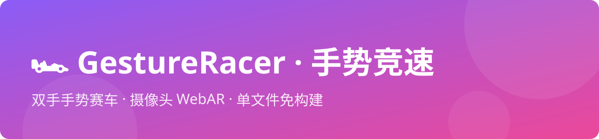

# GestureRacer · 手势竞速




> 纯前端 · 无构建 · 单文件 WebAR 手势竞速游戏

[](LICENSE)
[](https://threejs.org/)
[](https://developers.google.com/mediapipe)
[](#)

## 简介

`GestureRacer` 是一个基于浏览器摄像头的**双手手势赛车竞速游戏**。你的两只手就是方向盘和油门：

- 👈 **左手**：左右移动食指，控制赛车转向
- ✊ **右手**：握拳前进，拳头离摄像头越近速度越快（最高 200 KM/H！）

在 10 公里长的霓虹赛道上躲避障碍、全速冲刺，撞车会触发减速惩罚，冲过终点线还有一场烟花秀等着你。项目采用 **MediaPipe Hands** 实现双手实时追踪与握拳识别，**Three.js** 构建 3D 赛道场景，搭配 HUD 仪表盘、速度震动反馈等沉浸式体验。全部代码压缩在**单个 HTML 文件**中，无需任何构建工具即可运行。

## 功能特性

- 🏎️ **双手分工操控**：左手食指转向 + 右手握拳油门，体验真实赛车手的分工操作
- 🚀 **距离即速度**：通过手部在画面中的尺寸估算距离，拳头离摄像头越近，车速越高
- 🛣️ **10 公里霓虹赛道**：双色渐变粒子路面、车道标线、终点金色拱门
- 🧱 **动态障碍物**：50 个金属质感障碍随机分布在三条车道，碰撞触发减速惩罚
- 💥 **终点烟花秀**：冲线瞬间触发 8 连发粒子爆炸，庆祝通关
- 📊 **驾驶舱 HUD**：速度仪表盘（200 KM/H）、耗时计时、剩余里程、顶部进度条
- 🎮 **左右手逻辑互换**：一键切换左右手控制逻辑，适配左手习惯玩家
- ⚡ **零构建单文件**：一个 HTML 搞定全部逻辑与样式，复制即用

## 技术栈

| 技术 | 用途 |
| --- | --- |
| [MediaPipe Hands](https://developers.google.com/mediapipe) | 双手关键点追踪、握拳识别、手掌尺寸测距 |
| [Three.js r128](https://threejs.org/) | 3D 赛道场景构建与渲染（粒子路面、阴影、光照） |
| 原生 HTML / CSS / JS | 游戏逻辑与 HUD 界面 |

## 快速开始

### 方式一：直接打开

将 `Gesture-controlled racing car.html` 下载到本地，**双击用浏览器打开**即可。

> ⚠️ **注意**：手势识别依赖摄像头，请使用 **HTTPS** 环境或本地文件访问，并授予浏览器摄像头权限。若本地文件（`file://`）下摄像头无法调用，请使用方式二。

### 方式二：本地服务器运行

```bash
# Python
python -m http.server 8080

# 或 Node.js
npx serve .

# 然后访问
open http://localhost:8080
```

### 方式三：在线部署

将 HTML 文件直接拖入任意静态托管平台（GitHub Pages、Vercel、Netlify、Cloudflare Pages 等）即可上线。

## 游戏操作

1. **转向（左手）**：让左手进入摄像头画面，左右移动**食指**，赛车随之左右变道
2. **加速（右手）**：让右手进入画面，**握拳**触发油门。拳头握得越紧、离摄像头越近，速度越快
3. **刹车**：松开拳头即停止加速，赛车缓慢减速
4. **互换左右手**：点击左侧面板「左右手逻辑互换」按钮，适配左手习惯玩家

> **技巧**：手离摄像头越近，`handSize` 值越大（代码注释给出参考：远距离约 0.05–0.08，贴脸约 0.25–0.3），油门信号越强。

## 项目结构

```
gesture-racer/
└── Gesture-controlled racing car.html   # 全部代码（样式 + 逻辑 + 3D 场景），单文件即项目
```

## 核心机制

```
摄像头输入
   ↓ MediaPipe Hands 双手关键点追踪
   ↓ 分工处理
   ├─ 左手 → 食指 X 坐标 → 转向（映射到三车道）
   └─ 右手 → 握拳判定 + 手掌尺寸 → 油门信号（距离越近速度越快）
   ↓ Three.js 游戏循环
   ├─ 车辆沿 Z 轴推进，物理平滑加速/减速
   ├─ 障碍物碰撞检测 → 减速惩罚
   ├─ 里程追踪 → 冲线判定
   └─ 粒子烟花系统 → 终点庆祝
   ↓ HUD 实时更新 → 屏幕
```

## 游戏参数配置

所有核心参数集中在文件顶部的配置区：

```js
const TRACK_LENGTH = 10000;   // 赛道总长
const LANE_WIDTH = 12;        // 单车道宽度
const TOTAL_WIDTH = LANE_WIDTH * 3; // 总路宽（三车道）
const OBSTACLE_COUNT = 50;    // 障碍物数量
const MAX_SPEED_KMH = 200;    // 最高时速
```

速度控制核心逻辑（右手油门）：

```js
const sizeMin = 0.06;  // 手远离摄像头
const sizeMax = 0.25;  // 手贴近摄像头
let val = (handSize - sizeMin) / (sizeMax - sizeMin);
let targetKmh = val * MAX_SPEED_KMH;  // 归一化映射到 0–200 KM/H
if (targetKmh < 20) targetKmh = 20;   // 握拳低保速度
```

## 浏览器兼容性

- 支持 WebGL 与 `getUserMedia` 的现代浏览器（Chrome / Edge / Firefox / Safari）
- 建议在**桌面端**使用以获得最佳追踪体验（需双 手同时入镜）
- 移动端可通过 HTTPS 访问，但需注意性能表现

## License

[MIT](LICENSE) © 2025 GestureRacer Contributors

## 致谢

- [MediaPipe](https://developers.google.com/mediapipe) — 强大的跨平台机器学习解决方案
- [Three.js](https://threejs.org/) — 易用的 3D JavaScript 库

## 作者

陈启粤

---

最后更新：2026-08-06
